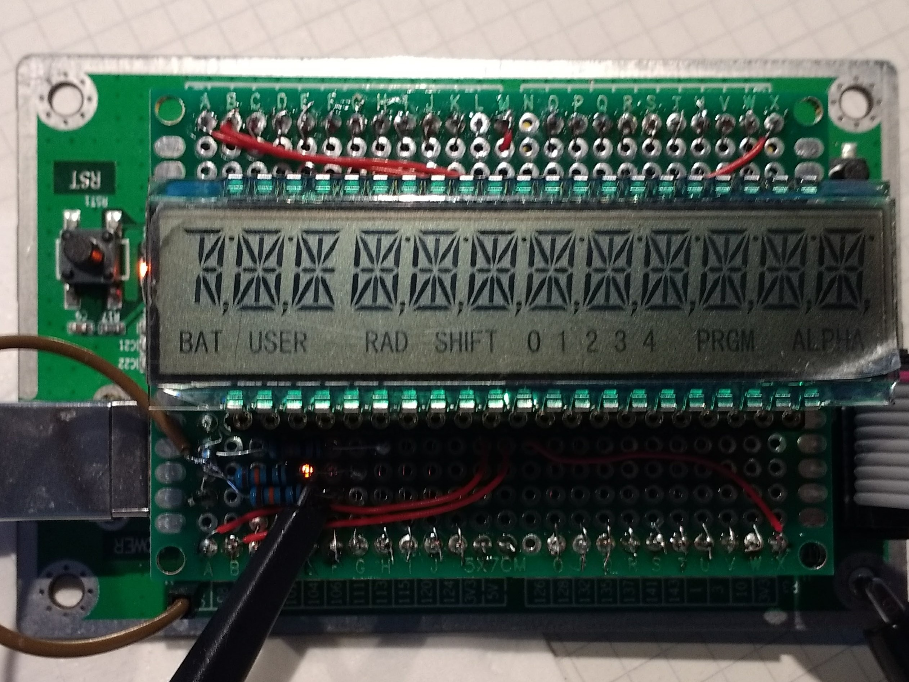
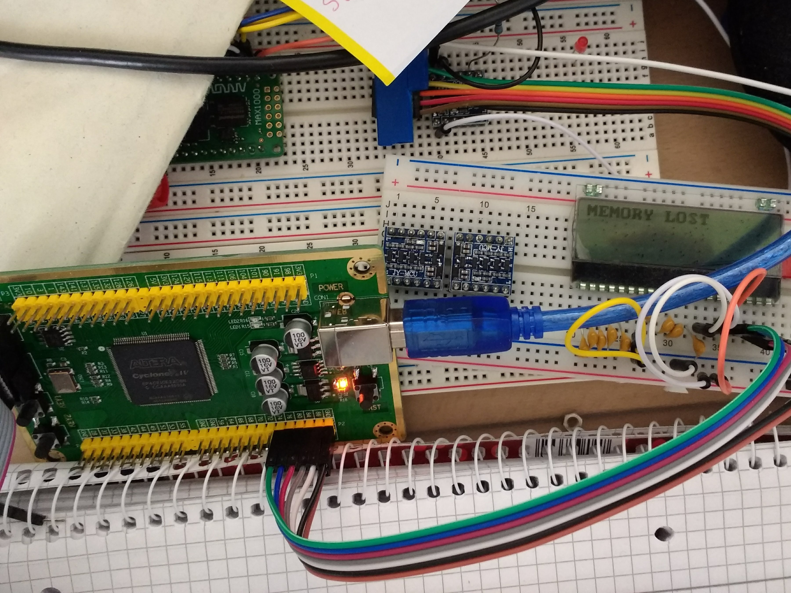

FullNut - A hardware implementation of the HP-41
-------

- 01_Sources\01_HDL : VHDL source and related test files

  Testbenches can be run using the icluded batch files and ghdl. For waveform viewing I'd recommend GTKWave.

- 04_Implementations\02_MachXO2 : Lattice MachXO2 target (Lattice Breakout board with LCMXO2-7000)
- 04_Implementations\03_CycloneIV : EP4CE10E22 on a breakout board with a 50 MHz crystal. Used currently for development. SignalTap enabled.

14-Segments LCD

Dot matrix LCD, partially working core

 

License
-------

 This work is licensed under a <a rel="license" href="http://creativecommons.org/licenses/by-nc-sa/4.0/">Creative Commons Attribution-NonCommercial-ShareAlike 4.0 International License</a>.
